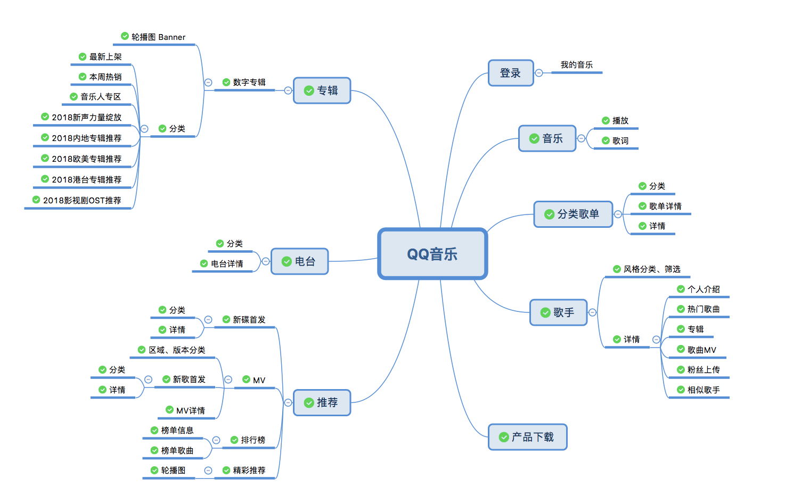

<h1 align="center">QQ Music API</h1>

<div align="center">

</div>

> QQ 音乐 API koa2 版本, 通过 Web 网页版请求 QQ 音乐接口数据

### API 结构图

> 目前暂时没有时间做登录模块的接口，欢迎各位大佬给我`PR`, 阿里嘎多



### 环境要求

> 因为本项目采用的是`koa2`, 所以请确保你的`node`版本是 7.6.0+

```
node -v
```

### 📦 安装

```
git clone git@github.com:Rain120/qq-music-api.git
cd qq-music-api
npm install
```

### 🔨 项目启动

```
// npm i -g nodemon
npm run start

// or don't install nodemon
node app.js
```

项目监听端口是`3200`

### 🐳 Docker

```sh
# local local build
npm run build:local-images

# local remote build
npm run build:remote-images

# build images
npm run build:images

# local run
npm run run:images

# remote run
docker pull qq-music-api
```

### 功能特性

- [x] 获取歌曲播放链接 **2021-01-24**

- [x] 支持自定义设置 `cookie` **2021-01-23**

- [x] 获取歌曲 + 专辑图片 **2020-05-24**

- [x] 获取歌手热门歌曲 **2020-07-04**

- [x] 获取 QQ 音乐产品的下载地址

- [x] 获取歌单分类

- [x] 获取歌单列表

- [x] 获取歌单详情

- [x] 获取 MV 标签

- [x] 获取 MV 播放信息

- [x] 获取歌手 MV

- [x] 获取相似歌手

- [x] 获取歌手信息

- [x] 获取歌手被关注数量信息

- [x] 获取电台列表

- [x] 获取专辑

- [x] 获取数字专辑

- [x] 获取歌曲歌词

- [x] 获取 MV

- [x] 获取新碟信息

- [x] 获取歌手专辑

- [x] ~~获取歌曲 VKey~~ **2021-01-24**

- [x] 获取搜索热词

- [x] 获取关键字搜索提示

- [x] 获取搜索结果

- [x] 获取首页推荐

- [x] 获取排行榜单列表

- [x] 获取排行榜单详情

- [x] 获取评论信息(cmd 代表的意思没太弄明白)

- [x] 获取票务信息

- [x] 获取歌单详情

- [x] 获取歌手列表

### 使用文档

使用`apis`详见[文档](https://rain120.github.io/qq-music-api/#/)
